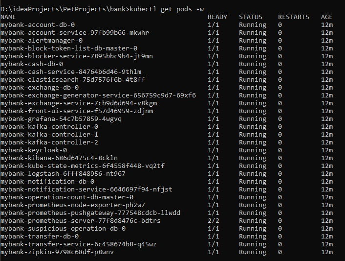
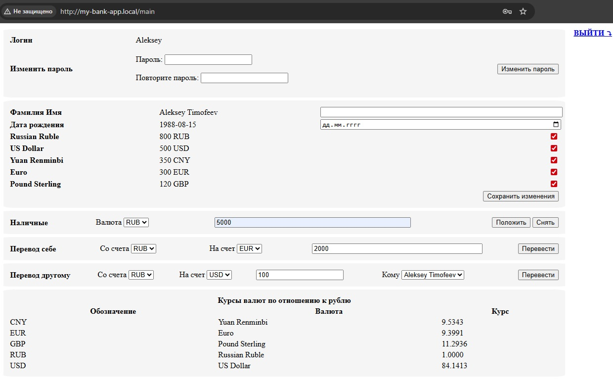
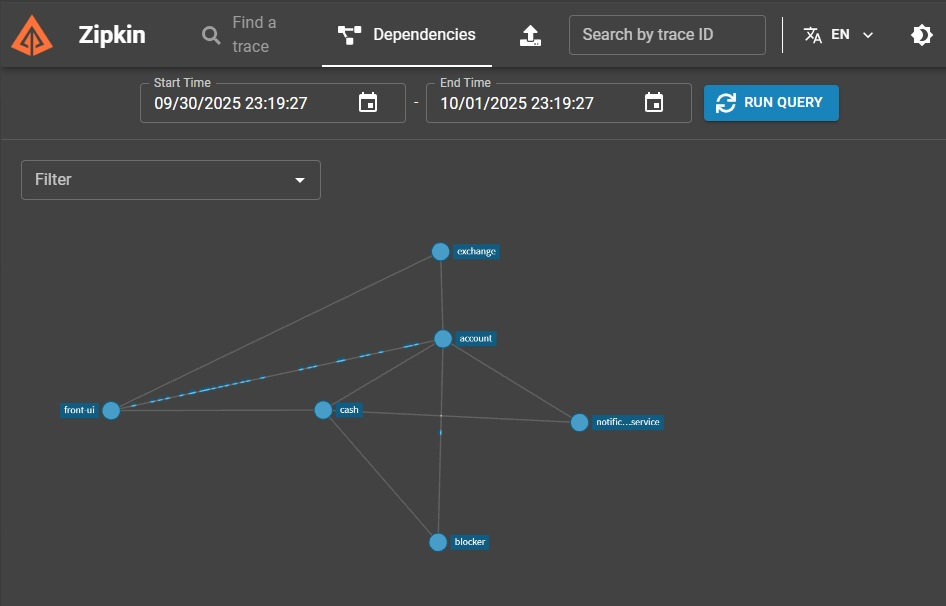

## 🏦 Микросервисное приложение «Банк»

### Стек технологий

- **Java 21**
- **Spring Boot Framework**
- **Spring Cloud**
- **Spring MVC для обработки HTTP-запросов**
- **Spring Security для ограничения доступа к функционалу приложения**
- **Spring Cloud Openfeign для отправки HTTP-запросов, ограничения частоты запросов, реализации резервных ответов**
- **OAuth2 Authorization Code Flow для взаимодействия между микросервисами**
- **Keycloak сервер авторизации для получения/проверки jwt токенов**
- **Postgres база данных для хранения сущностей приложения**
- **Redis база данных для кеширования**
- **Liquibase для миграции базы данных**
- **OpenApi generator для генерации контроллеров RestFull сервиса и клиента к нему**
- **Testcontainers, JUnit 5, Assertj, Mockito для тестирования**
- **Mapstruct для преобразования сущностей базы данных и сущностей передачи данных**
- **WebTestClient для интеграционного тестирования**
- **Thymeleaf для шаблонов html страниц**
- **Spring validation для валидации пользовательских данных**
- **Lombok для генерации шаблонного кода**
- **Jenkins для развёртывания приложения**
- **Kubernetes для оркестрации контейнеризированных сервисов**
- **Kafka для взаимодействия между сервисами**

### [Сервис аккаунтов (Account)](account)
Сервис аккаунтов хранит информацию о зарегистрированных аккаунтах и счетах в каждом из них (именно в нём хранятся 
логин/пароль, которые проверяются при аутентификации пользователя). 

### [Сервис обналичивания денег (Cash)](cash)
Сервис обналичивания денег осуществляет пополнение счёта или снятие денег со счёта.

### [Сервис перевода денег между счетами (Transfer)](transfer)
Сервис перевода денег между счетами осуществляет перевод денег между счетами одного пользователя и между счетами 
разных пользователей.

### [Сервис блокировки подозрительных операций (Blocker)](blocker)
Сервис блокировки подозрительных операций отслеживает подозрительные операции.

### [Сервис конвертации валют (Exchange)](exchange)
Сервис конвертации валют хранит информацию о конвертации валюты при её покупке/продаже.

### [Сервис генерации курсов валют (Exchange Generator)](exchange-generator)
Сервис генерации курсов валют каждую секунду по расписанию генерирует курсы валют и выполняет REST-запросы в сервис Exchange.

### [Сервис уведомлений (Notification)](notification)
Сервис уведомлений отправляет уведомления пользователю о выполненном действии: вход в аккаунт, переводе денег, 
пополнении счёта, снятии денег со счёта и т. д.

### Схема взаимодействия сервисов:


## Запуск приложения

Склонировать репозиторий с кодом и перейти в корневую директорию проекта.

```bash
git clone https://github.com/alextim1508/bank
```

Для запуска приложения необходимо установить следующие компоненты:

- Kubectl
- Helm
- Minikube
- Jenkins

После установки указанных компонентов необходимо запустить Minikube:
- minikube start --vm-driver=docker --cpus=8 --memory=8192
- minikube addons enable ingress
- minikube addons enable storage-provisioner
- minikube addons enable default-storageclass

Далее заходим в Jenkins и добавляем в Blue Ocean Git проект из файла со ссылкой на текущий проект
Jenkins подхватит Jenkinsfile и запустит пайплайн по сборке, установке и запуску необходимых компонентов приложения.

После успешного выполнения пайплайна необходимо убедиться, что все поды успешно стартовали

```bash
kubectl get pods
```




После успешного старта всех подов необходимо запустить команду от имени администратора:

```bash
minikube tunnel
```

В файле **C:\Windows\System32\drivers\etc\hosts** добавить строчку:

```bash
127.0.0.1 my-bank-app.local
```

После этого фронт приложения будет доступен по ссылке http://my-bank-app.local/login

Откроется страница входа.


Используйте данные пользователя:

```bash
username: Aleksey
password: pass
```

Откроется страница приложения 




##### Zipkin
Для отслеживания запросов, проходящих через цепочку микросервисов, можно использовать анализатор трейсов Zipkin

```bash
kubectl port-forward svc/mybank-zipkin 9411:9411
```

```bash
http://localhost:9411
```




