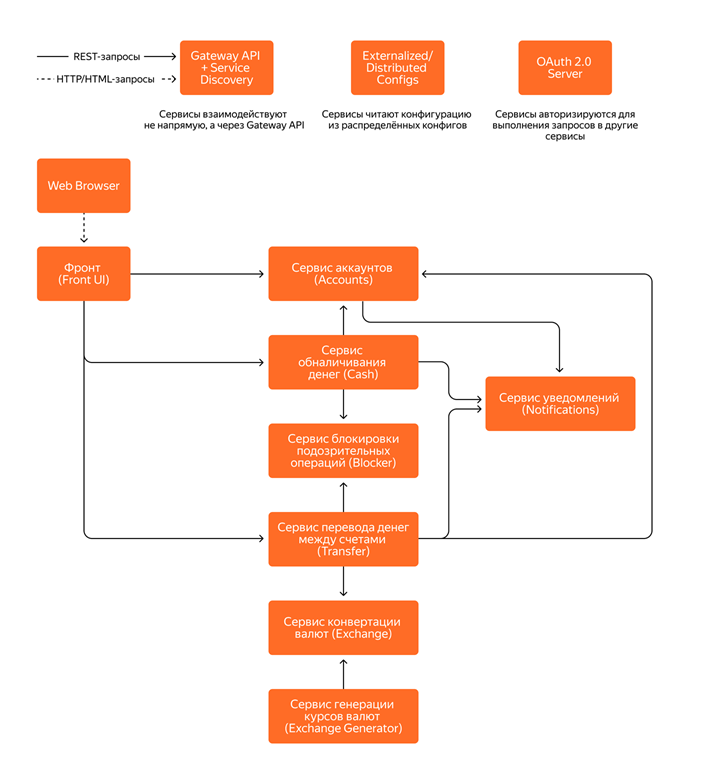
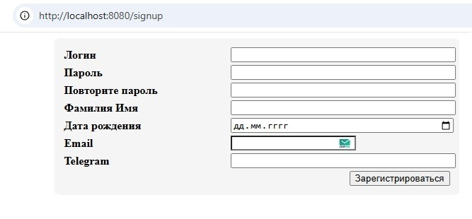

# bank

Микросервисное приложение Банк с использованием Spring Boot и паттернов микросервисной архитектуры.

## Стек технологий

- **Java 21**
- **Spring Framework**
- **Spring MVC** для обработки HTTP-запросов
- **Spring Security для ограничения доступа к функционалу приложения**
- **OAuth2 Authorization Code Flow для взаимодействия между бэкенд-сервисами**
- **Keycloak сервер авторизации для получения/проверки jwt токенов**
- **Postgres база данных для хранения сущностей приложения**
- **Redis база данных для кеширования**
- **Redis база данных для хранения сессий пользователей**

- **Liquibase для миграции базы данных**


- **OpenApi generator для генерации контроллеров RestFull сервиса и клиента к нему**
- **Testcontainers, JUnit 5, Assertj, Mockito для тестирования**
- **Mapstruct для преобразования сущностей базы данных и сущностей передачи данных**
- **WebTestClient для интеграционного тестирования**
- **Thymeleaf для шаблонов html страниц**
- **Spring validation для валидации пользовательских данных**
- **Lombok для генерации шаблонного кода**
- **Docker для развёртывания и запуска контейнеров postgres, redis, keycloak и разработанных веб-приложений**
e


## [Сервис аккаунтов (Accounts)](accounts)
Сервис аккаунтов хранит информацию о зарегистрированных аккаунтах и счетах в каждом из них (именно в нём хранятся логин/пароль, которые проверяются при аутентификации пользователя). 
- Фронт выполняет REST-запросы из блока настроек аккаунта в сервис Accounts при получении данных аккаунта и данных о счетах, их редактировании, добавлении и удалении.
- В свою очередь, Accounts выполняет REST-запросы в Notifications.
- Также в Accounts приходят запросы при регистрации нового аккаунта (из формы регистрации).

## [Сервис обналичивания денег (Cash)](cash)
Сервис обналичивания денег осуществляет пополнение счёта или снятие денег со счёта.
- Фронт выполняет REST-запросы из блока внесения и снятия виртуальных денег в сервис Cash.
- В свою очередь, Cash выполняет REST-запросы в Accounts, Blocker и Notifications.

## [Сервис перевода денег между счетами (Transfer)](transfer)
Сервис перевода денег между счетами осуществляет перевод денег между счетами одного пользователя и между счетами разных пользователей.
- Фронт выполняет REST-запросы из блока перевода денег между своими счетами и блока перевода денег на счёт другого аккаунта в сервис Transfer.
- В свою очередь, Transfer выполняет REST-запросы в Accounts, Exchange, Blocker и Notifications.

## [Сервис блокировки подозрительных операций (Blocker)](blocker)
Сервис блокировки подозрительных операций отслеживает подозрительные операции.

## [Сервис конвертации валют (Exchange)](exchange)
Сервис конвертации валют хранит информацию о конвертации валюты при её покупке/продаже (базовой валютой считается RUB, её конвертация при продаже/покупке равна 1).
Фронт выполняет REST-запросы из блока курсов валют в сервис Exchange для получения информации о курсах валют.

## [Сервис генерации курсов валют (Exchange Generator)](exchange-generator)
Сервис генерации курсов валют каждую секунду по расписанию генерирует курсы валют и выполняет REST-запросы в сервис Exchange.
Валют должно быть не меньше трёх: RUB, USD, CNY. Базовой валютой считается RUB, то есть при конвертации, например, из USD в CNY сначала USD конвертируется в RUB, а потом RUB в CNY.

## [Сервис уведомлений (Notifications)](notification)
Сервис уведомлений отправляет уведомления пользователю о выполненном действии: вход в аккаунт, переводе денег, пополнении счёта, снятии денег со счёта и т. д.

### Схема взаимодействия сервисов:



Схема аутентификации:

Микросервисы должны аутентифицироваться/авторизовываться на сервере авторизации по client credentials, чтобы выполнять запросы в другие микросервисы.

В качестве Service Discovery и Gateway API можно применять Consul

Микросервисы должны выполнять запросы в другие микросервисы через Gateway API и регистрироваться в Service Discovery.


Аутентификация/авторизация пользователей должны быть по логину/паролю.


Склонировать репозиторий с кодом и перейти в корневую директорию проекта.

```bash
git clone https://github.com/alextim1508/bank
```

Запустить docker compose файл.

```bash
docker-compose -f docker-compose.yml up -d
```

Открыть в браузере вкладку с адресом.

```bash
http://localhost:8080/
```
Откроется главная страница витрины интернет-магазина.


Используйте данные пользователя:

```bash
username: alex
password: password
```




